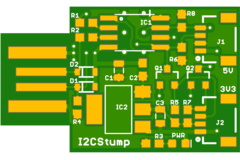
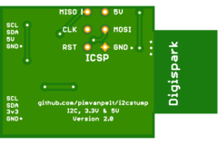

# Digistump I2C dongle

## Hardware 

This device is an adaptation of [Digistump](http://digistump.com/products/1)'s
USB device, with two added [Qwiic](https://www.sparkfun.com/qwiic) connectors.
The first is used as a 5V I2C port, and the second has a level shifter to 3.3V
using [BSS138](https://www.onsemi.com/pub/Collateral/BSS138-D.PDF) FETs to
create a 3.3V I2C port. It's slightly bigger than the original, coming in 
at 31.2 x 19.0 mm, and plugs directly into a USB port.

See my [Oshpark project](https://oshpark.com/shared_projects/iBBtdp7S).

### Bill of Materials

*   C1,C3: Tantalum 4.7 μF (0805)
*   C2: Ceramic 0.1 μF (0603)
*   D1,D2: 3.6V Zener (SOD-323)
*   D3: Green LED (0603)
*   IC1: ATTINY85 (SO08)
*   IC2: AM1117 3.3V (SOT223)
*   J1,J2: QWIIC Connector (1X04 1MM RA)
*   Q1,Q2: BSS138 (SOT23-3)
*   R1,R2: 66 Ω (0603)
*   R3,R4: 1.5 kΩ (0603)
*   R5-R8: 10 kΩ (0603)

## Firmware

Firmware is [I2C-Tiny-USB](https://github.com/harbaum/I2C-Tiny-USB) which
is detected under Linux using the [i2c-tiny-usb](https://github.com/torvalds/linux/blob/master/drivers/i2c/busses/i2c-tiny-usb.c)
driver.

## Acknowledgements

Thanks go to:

*   Digistump LLC for sharing the device under Creative Commons.
*   Till Harbaum for an excellent ATTINY85 firmware for an I2C bridge.

