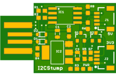

# Digistump I2C dongle

This device is a copy of [Digistump](http://digistump.com/products/1)'s USB
device, with two added [Quiic](https://www.sparkfun.com/qwiic) connectors.
The first is used as a 5V I2C port, and the second has a level shifter to 3.3V
using [BSS138](https://www.onsemi.com/pub/Collateral/BSS138-D.PDF) FETs to
create a 3.3V I2C port.

## Firmware

Firmware is [I2C-Tiny-USB](https://github.com/harbaum/I2C-Tiny-USB) which
is detected under Linux using the [i2c-tiny-usb](https://github.com/torvalds/linux/blob/master/drivers/i2c/busses/i2c-tiny-usb.c)
driver.

## Acknowledgements

Thanks go to:

*   Digistump LLC for sharing the device under Creative Commons.
*   Till Harbaum for an excellent ATTINY85 firmware for an I2C bridge.

