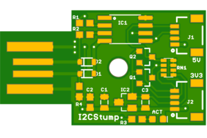
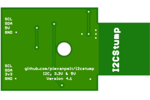

# Digistump I2C dongle

## Version 4 - USB Dongle

## Version 5 - USB-C Connector

## Hardware 

This device is an adaptation of [Digistump](http://digistump.com/products/1)'s
USB device, with two added [Qwiic](https://www.sparkfun.com/qwiic) connectors.
The first is used as a 5V I2C port, and the second has a level shifter to 3.3V
using [BSS138](https://www.onsemi.com/pub/Collateral/BSS138-D.PDF) FETs to
create a 3.3V I2C port. It's slightly bigger than the original, coming in 
at 31.2 x 19.0 mm, and plugs directly into a USB port.

See my Oshpark projects: [v2](https://oshpark.com/shared_projects/iBBtdp7S),
[v3](https://oshpark.com/shared_projects/8I7qjXw7), 
[v4](https://oshpark.com/shared_projects/ChwKt4Mn),
[current-v5](https://oshpark.com/shared_projects/Jq9YXZ0q).

You can see a few pictures of the v3 board [here](https://photos.app.goo.gl/4XRo74y9Bt4kZoqR7).

### Bill of Materials

*   C1,C3: Tantalum 4.7 μF (0805)
*   C2: Ceramic 0.1 μF (0603)
*   D1,D2: 3.6V Zener (SOD-323)
*   D3: Blue (activity) LED (0603)
*   D4: Red (power) LED (0603)
*   IC1: ATTINY85 (SO08)
*   IC2:
    *   v2: AM1117 3.3V (SOT223)
    *   v3+: MCP1703 3.3V (SOT23)
*   J1,J2: QWIIC Connector (1X04 1MM RA)
*   Q1,Q2: BSS138 (SOT23-3)
*   R1,R2: 66 Ω (0603)
*   R3,R7: 680 Ω (0603)
*   R4: 2.2 kΩ (0603)
*   R5,R6: 5.1 kΩ (0603)
*   RN1: 10 kΩ (0805)
*   USB-C 16 pin connector

To build this board by hand, take a look at the [instructions](BUILDING.md).

## Firmware

The ATTiny85 is first flashed with [Micronucleus](https://github.com/micronucleus/micronucleus),
a bootloader which equips the microcontroller with a minimal USB interface. You can use the
`ICSP` touchpoint header at the bottom of the board to flash.

Firmware which runs under the micronucleus bootloader is [I2C-Tiny-USB](https://github.com/harbaum/I2C-Tiny-USB)
which is detected under Linux using the [i2c-tiny-usb](https://github.com/torvalds/linux/blob/master/drivers/i2c/busses/i2c-tiny-usb.c)
driver.

## Acknowledgements

Thanks go to:

*   Digistump LLC for sharing the original for this device under Creative Commons.
*   Tim Böscke, Jenna Fox, Shay Green et al for the Micronucleus bootloader.
*   Till Harbaum for an excellent ATTINY85 firmware for an I2C bridge.
